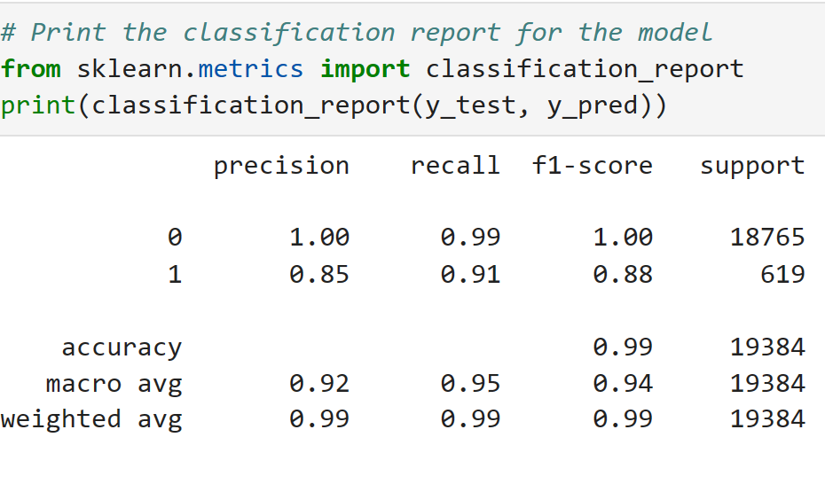
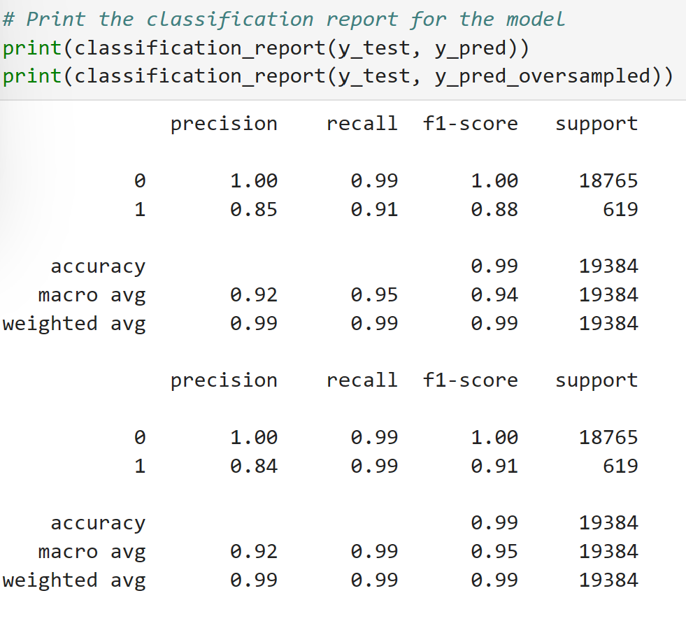

#  Credit Worthiness and Classifying Risk using Supervised Machile Learning
We use Supervised Learning's imbalanced-learn library to analyze financial historical data and identify lending risk and credit worthyness. 

### Peer to peer lending data is used for analysis
    lending_data.csv
 
### General Method using Machine Learning:
1. Analyze and clean data
2. Resample data
3. Define target data (X - Y) and train data set
4. Predict and calculate the Balance Accuracy Score
5. Improve score and predictions with a "Confusion Matrix"
6. "Classification Report"

   
---
## Technologies
### Python:

    Phyton Version: **3.7.13**

## Information about Libraries and concepts used here:

### sklearn
[sklearn](https://scikit-learn.org/stable/)

### Balanced Accuracy Score
[balanced-accuracy-score](https://scikit-learn.org/stable/modules/generated/sklearn.metrics.balanced_accuracy_score.html)

### Confusion Matrix
[holoviews](https://scikit-learn.org/stable/auto_examples/model_selection/plot_confusion_matrix.html) 

### Classification Report Imbalanced
[classification_report_imbalanced](https://datascience.stackexchange.com/questions/64441/how-to-interpret-classification-report-of-scikit-learn)

### Train Test Slit
[train_test_split](https://scikit-learn.org/stable/modules/generated/sklearn.model_selection.train_test_split.html)

### Logistic Regression
[logistic_regression](https://scikit-learn.org/stable/modules/generated/sklearn.linear_model.LogisticRegression.html)

### Accuracy Score
[accuracy_score](https://scikit-learn.org/stable/modules/model_evaluation.htm)

---
<!--How to run -->
## Use Case and how to run
1. Clone the repository and open Jupyter notebook.
2. Install the libraries and dependencies 

        Install commands
            conda activate dev
            conda install -c conda-forge imbalanced-learn

        Import on starter file
            import numpy as np
            import pandas as pd
            from pathlib import Path
            from sklearn.metrics import balanced_accuracy_score
            from sklearn.metrics import confusion_matrix
            from imblearn.metrics import classification_report_imbalanced
            from sklearn.model_selection import train_test_split
            from sklearn.linear_model import LogisticRegression

---
## DEMO files and figures

### Original Lending Data

### Classification Report Table

### Balanced Accuracy Score and Confusion Matrix:

### Classification Reports: Original and Oversampled

---

## Contributors
Startup code provided by UW FinTech program

---
## License
Tool is available under an MIT License.

---
## Aknowledgements
* [Markdown Guide](https://www.markdownguide.org/basic-syntax/#reference-style-links)

