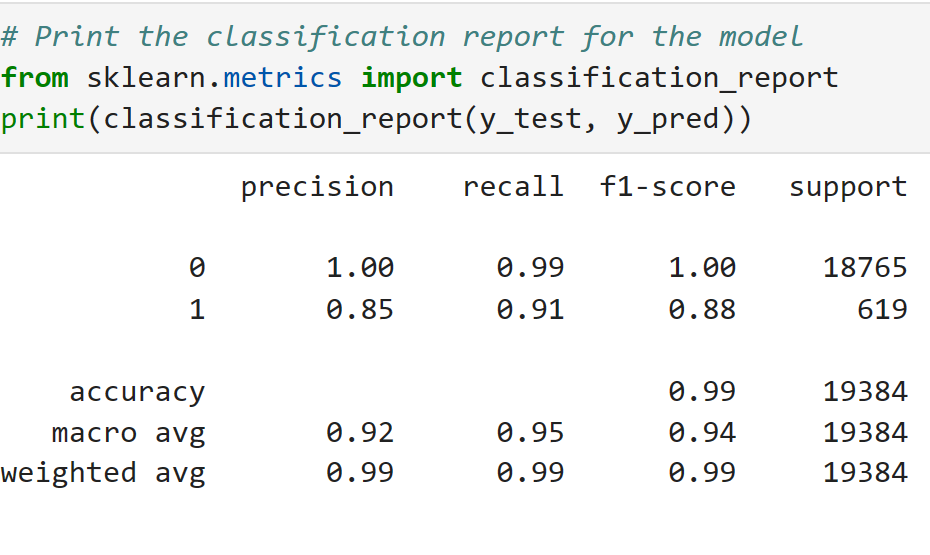
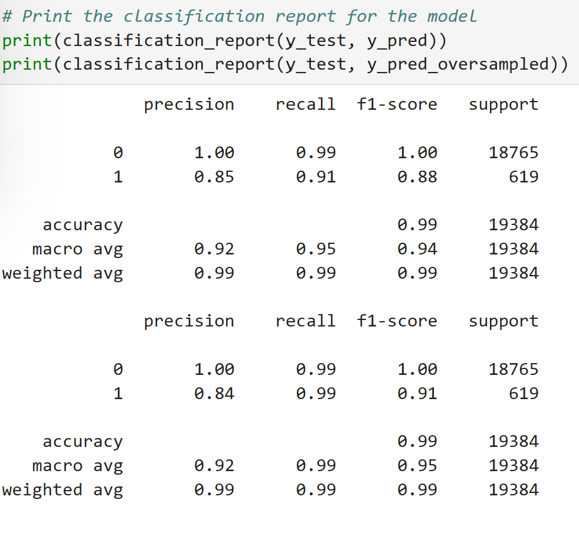

# Credit Worthiness Report
## Purpose
This application pedicts risk through Supervised Learning's imbalanced-learn library.
It uses a dataset of historical lending activity from a peer-to-peer lending services company to build a model that can identify and predict the creditworthiness of borrowers within a high degree of accurary. 

## Files used for analysis
    lending_data.csv

## Report data and variables for consideration
- History of loans
- Loan amount
- Loan interest rate
- Demographics: Income
- Loan Defaults
- Borrower total debt
- Loan Status ( 1 = Risky vs. 0 = Healthy Loan)

### Understanding the Loan Stauts
The most important variables were Loan Status which were classified in 2
- Risky loans = value of "1"
- Healthy Loan = value of "0"
This approach improves the balance of the dataset to be used by Machine Learning. The more balanced the easier it will be draw calculations for such complex algorithms. 

## Generalized Approach for machine learning predictions
1. Extraction
    - Data Analyis of data set: (lending_data.csv)
2. Transformation 
    - Datta resampling using a Random over sampler
    - Understand that data is inbalanced. 
3. Train Machine on  model
    - Target classes  (x and y)
    - Apply logistic regression
4. Predict results    
5. Understand: Balanced Accuracy Score
    What the numbers mean
6. Deploy a "Confusion Matrix" if needed to re-run a prediction and generate a "classification report"
7. Interpret variables in Classification Report and compare results with original prediction.

## Models Produced:

### Logistic Regression
- Original data needed to be fitted accordingly if balanced or inbalanced

### Different Model 
- Data and model needed to be fitted with a different method for improved prediction. This case we the "oversampling" technique.

## Summary of Analysis Credit Risk Analysis Results and Recommendations
The analysis reveals that Healty Loans (maked with a '0' in the data set) are predicted 99% accuracy based on its F1 Score. 
Risky Loans are predicted with a 91% accuracy after the using the oversampling technique. Such score is better than the inintial value predicted of 88%
There are other methods to consider for type of analysis, however it is recommended for these to be explored in futher studies. 